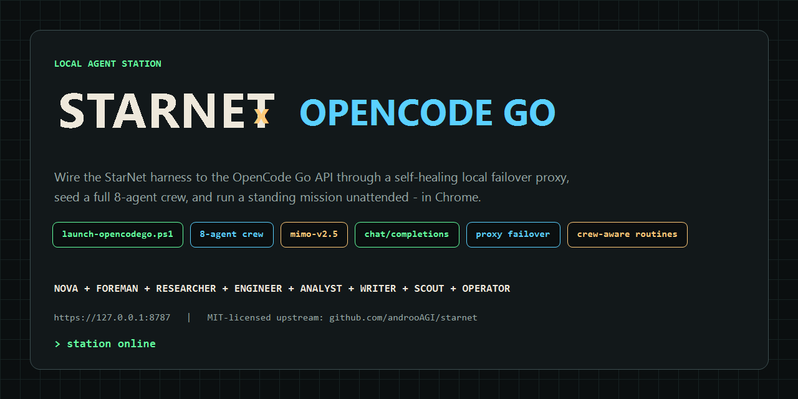
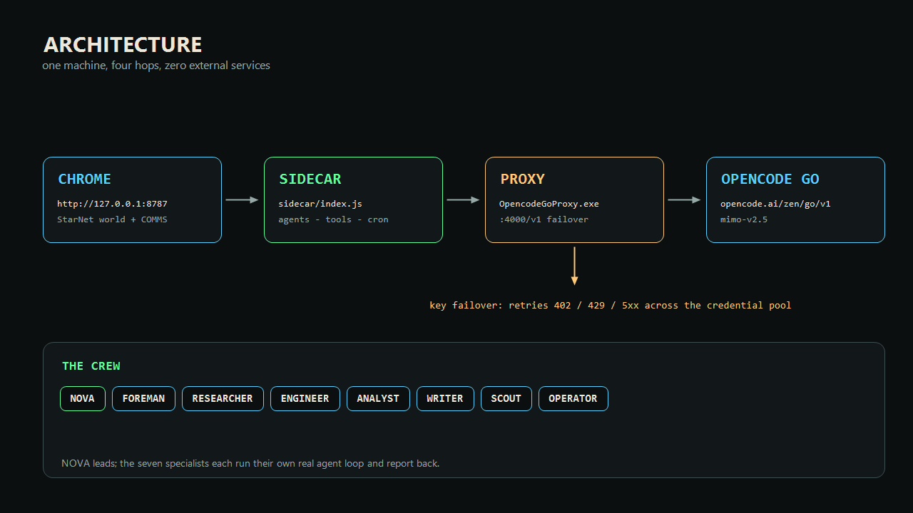
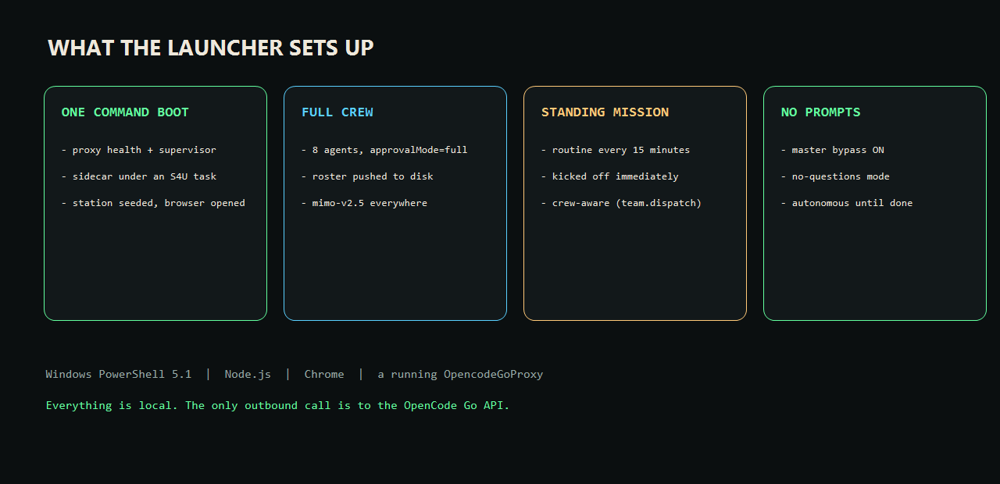
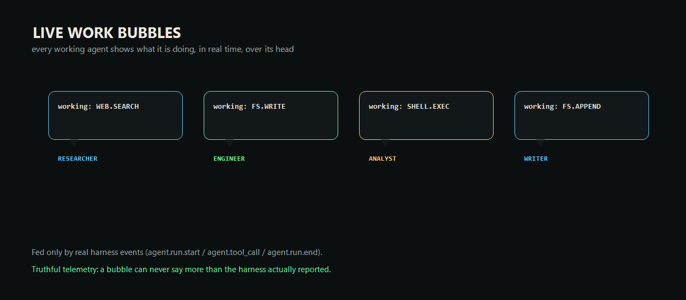

# StarNet x OpenCode Go Station

Wire the [StarNet](https://github.com/androoAGI/starnet) agent harness to the **OpenCode Go** API through a
self-healing local failover proxy, seed a full **8-agent crew**, and run a standing mission **unattended** — all
in Chrome, all on one machine.



- **Model:** `mimo-v2.5` over the `chat/completions` wire
- **Brain:** a local `OpencodeGoProxy` on `http://127.0.0.1:4000/v1` with credential failover
- **UI:** StarNet sidecar on `http://127.0.0.1:8787`
- **Team:** NOVA + FOREMAN + RESEARCHER + ENGINEER + ANALYST + WRITER + SCOUT + OPERATOR

> **Deployment URL:** this project runs locally and is **not** deployed to the public internet. The live URL is
> the local station: `http://127.0.0.1:8787`. There is no hosted/public URL.

---

## Architecture



One machine, four hops, zero external services beyond the OpenCode Go API:

1. **Chrome** loads the StarNet world + COMMS from `http://127.0.0.1:8787`.
2. The **sidecar** (`sidecar/index.js`) runs every agent loop, tool, routine and the SSE bridge.
3. The **proxy** (`OpencodeGoProxy.exe`) listens on `http://127.0.0.1:4000/v1`, holds the credential pool, and
   fails over on `402 / 429 / 5xx`.
4. **OpenCode Go** (`https://opencode.ai/zen/go/v1`) serves `mimo-v2.5`.

---

## Quick start

Prerequisites: **Windows PowerShell 5.1**, **Node.js**, **Chrome**, and a running **OpencodeGoProxy** with its
config (listen prefix + local bearer + upstream keys).

1. Clone upstream StarNet and place the three deployment scripts at the **repository root**:

   ```powershell
   git clone https://github.com/androoAGI/starnet.git C:\StarNet
   Copy-Item .\scripts\launch-opencodego.ps1            C:\StarNet\
   Copy-Item .\scripts\prepare-opencodego-station.js    C:\StarNet\
   Copy-Item .\scripts\kickoff-mission.ps1              C:\StarNet\
   ```

2. Apply the integration patch (adds the `opencode-go` provider profile, the Responses adapter, the
   crew-aware routines, and the live work bubbles):

   ```powershell
   cd C:\StarNet
   git apply ..\starnet-opencodego-station\patches\starnet-opencodego.patch
   Copy-Item ..\starnet-opencodego-station\patches\new-files\sidecar\providers\responses.js sidecar\providers\
   npm install ajv@8.20.0 undici@6.28.1 --no-save --ignore-scripts --package-lock=false
   ```

3. Run it:

   ```powershell
   powershell -ExecutionPolicy Bypass -File C:\StarNet\launch-opencodego.ps1
   ```

   Add `-NoBrowser` to skip opening Chrome, `-KeepRunning` to adopt an already-serving station, or
   `-ProxyDir <path>` to point at a different proxy folder.

---

## What the launcher does



1. Verifies the proxy `/health`, then keeps it under a **self-healing scheduled task** (`StarNet-OpenCodeGoProxy`).
2. Validates the model against the live proxy catalog.
3. Performs a **clean restart** of the sidecar, clears stale spend receipts, and seeds the station
   (`prepare-opencodego-station.js`) with the hero + 7 specialists on `mimo-v2.5` / `opencode-go`, `approvalMode=full`.
4. Starts the sidecar under a **S4U scheduled task** (`StarNet-OpenCodeGo`) — session 0, no console — with a
   supervisor loop so the station self-heals at both levels.
5. Turns on master bypass + no-questions mode.
6. Creates (and refreshes) the standing **mission routine** and kicks it off immediately, holding the run stream.
7. Opens Chrome at `http://127.0.0.1:8787`.

---

## The crew

| Agent | Role | Job |
|---|---|---|
| **NOVA** | Orchestrator | Takes missions, delegates, monitors, reports |
| **FOREMAN** | Team Lead | Splits work, tracks workers, reissues stalled jobs |
| **RESEARCHER** | Researcher | Live web research, sourced claims |
| **ENGINEER** | Engineer | Reads before changing, builds and fixes, verifies by running |
| **ANALYST** | Analyst | Computes and verifies the numbers |
| **WRITER** | Scriptwriter | Docs, scripts and content in the requested voice |
| **SCOUT** | Scout | Watches sources, reports only real change |
| **OPERATOR** | Automator | Runs routine/scheduled work idempotently |

A scheduled routine is **crew-aware**: the routine's agent runs as a *lead* and can `team.dispatch` real work to
the named specialists, each of which runs its own independent agent loop.

---

## Live work bubbles



While an agent is working, a persistent bubble over its head names what it is doing **right now** (its current
tool), driven only by real harness events (`agent.run.start` / `agent.tool_call` / `agent.run.end`). A real spoken
line always wins the single bubble; the work status shows whenever there is no live speech. A TTL sweep means a
lost `run.end` degrades to silence instead of a stuck bubble.

---

## Repository layout

```
starnet-opencodego-station/
  README.md
  LICENSE                 MIT, with upstream attribution
  .gitignore
  assets/                 images, generated programmatically (no screenshots)
  docs/
    ARCHITECTURE.md       design notes and the exact upstream changes
  scripts/
    launch-opencodego.ps1        <- PRIMARY ENTRY POINT
    prepare-opencodego-station.js
    kickoff-mission.ps1
    probe-keys.js                credential health (never prints keys)
    probe-protocols.js           which wire each model speaks
  patches/
    starnet-opencodego.patch     unified diff against upstream StarNet
    new-files/sidecar/providers/responses.js
  tools/
    make-assets.ps1              regenerates every image in assets/
```

---

## Verification

- All scripts parse and run under **Windows PowerShell 5.1** (`powershell.exe`), not PowerShell 7.
- `tools/make-assets.ps1` regenerates the images deterministically (Windows PowerShell 5.1 + `System.Drawing`).
- `scripts/probe-keys.js` and `scripts/probe-protocols.js` are read-only diagnostics; they never print key material.
- No credentials, tokens or private keys are stored in this repository — the launcher reads the proxy's local
  bearer from the proxy's own `config.json` at runtime.

---

## License & attribution

MIT. Upstream StarNet is MIT, Copyright (c) 2026 Andrew Sims — see [LICENSE](LICENSE). This project is an
independent integration layer that patches a local StarNet checkout; it does not redistribute upstream source.
